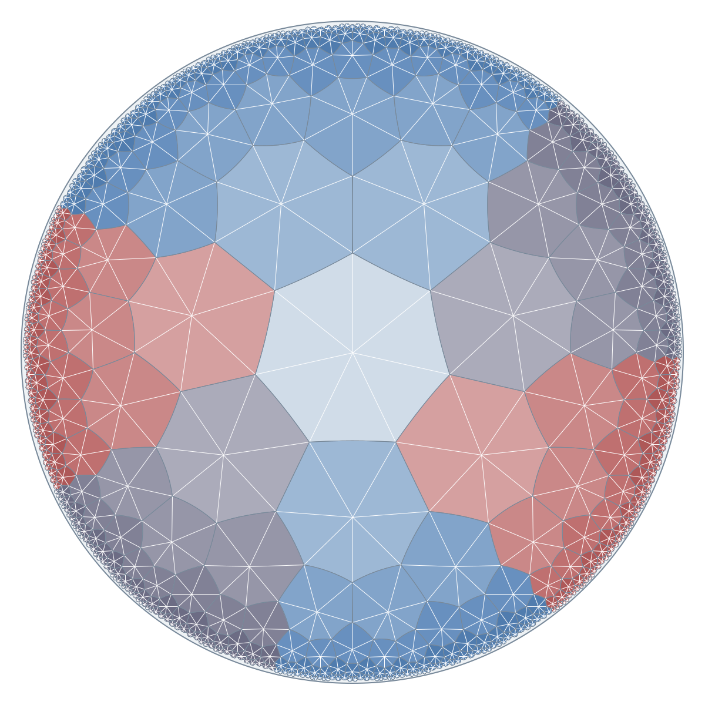
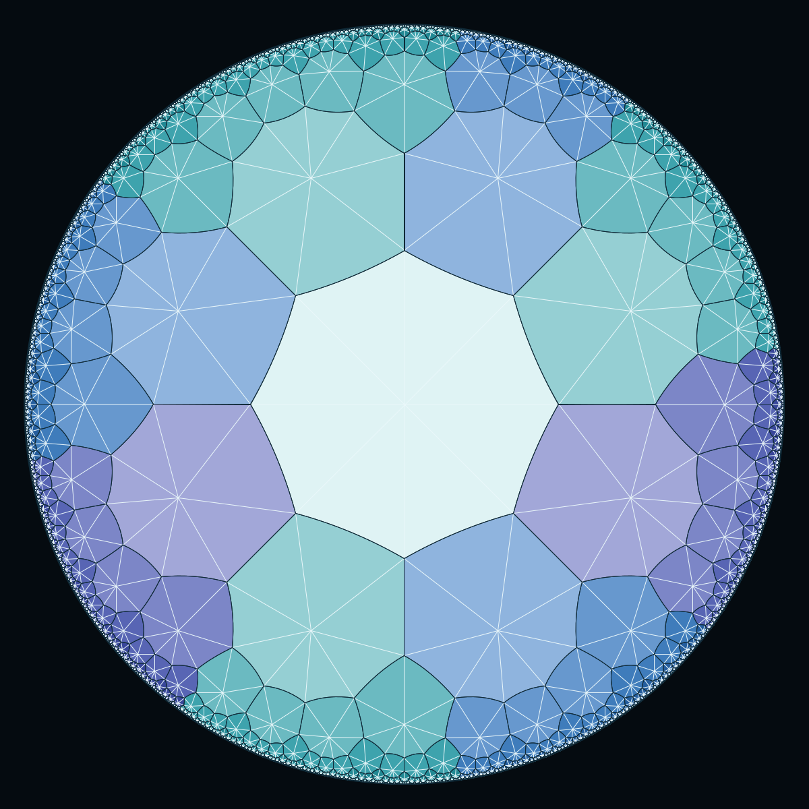
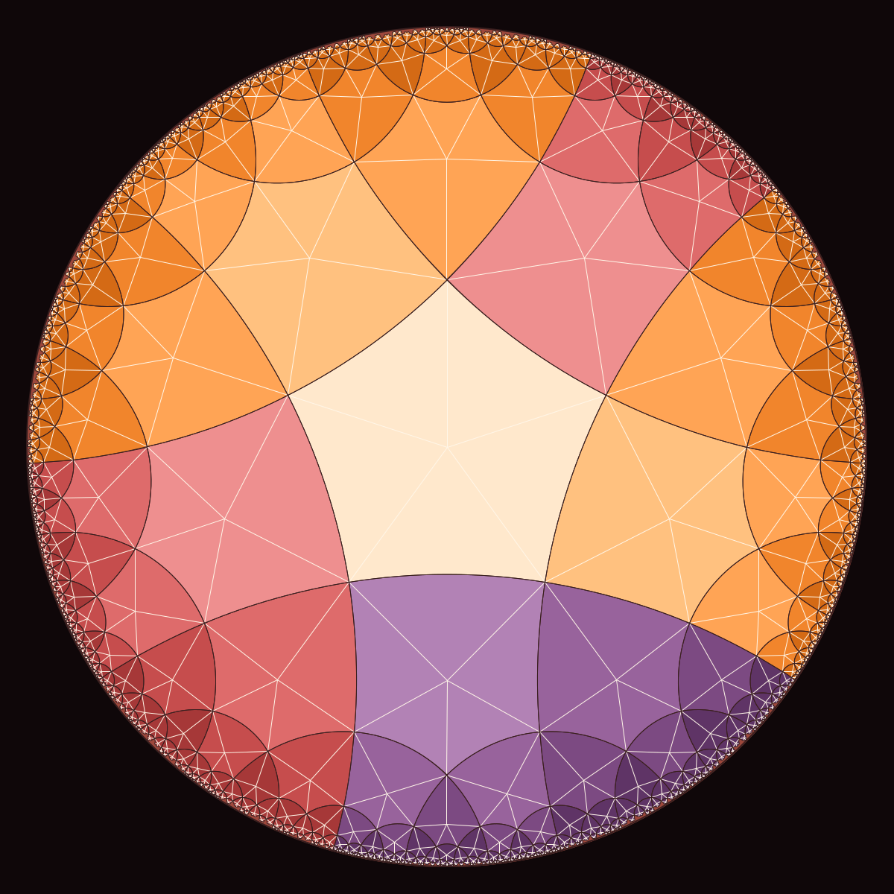
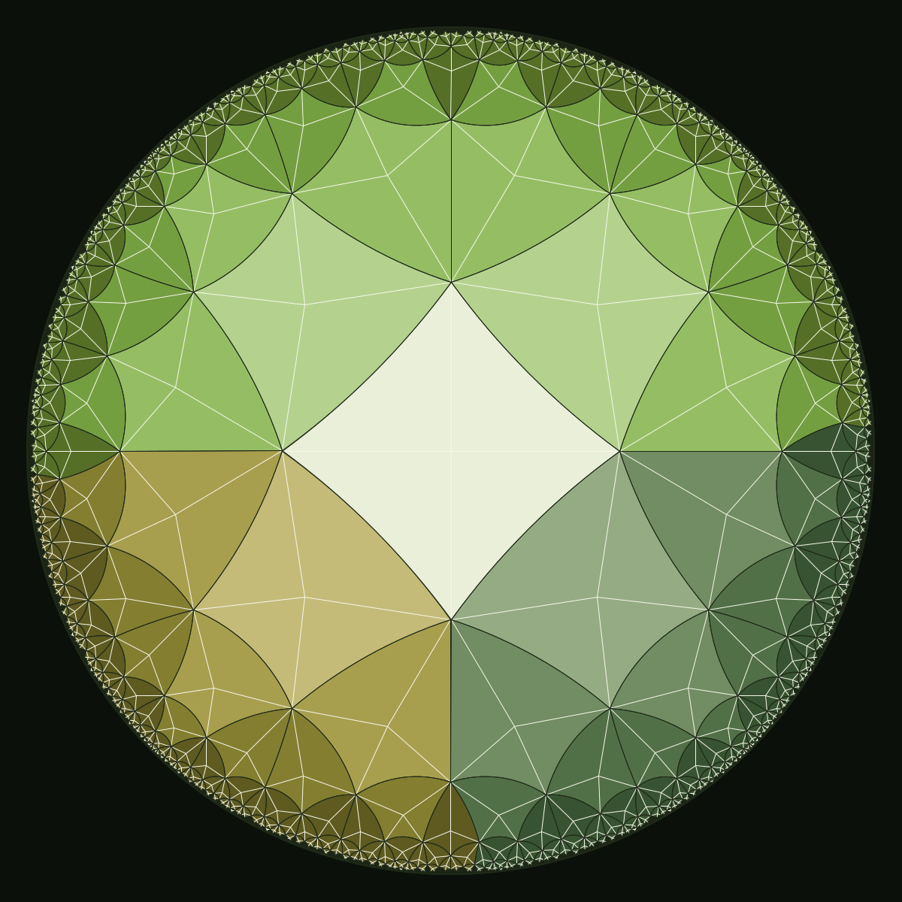
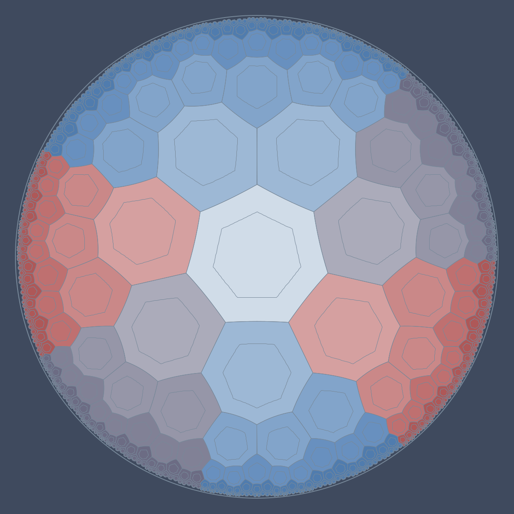
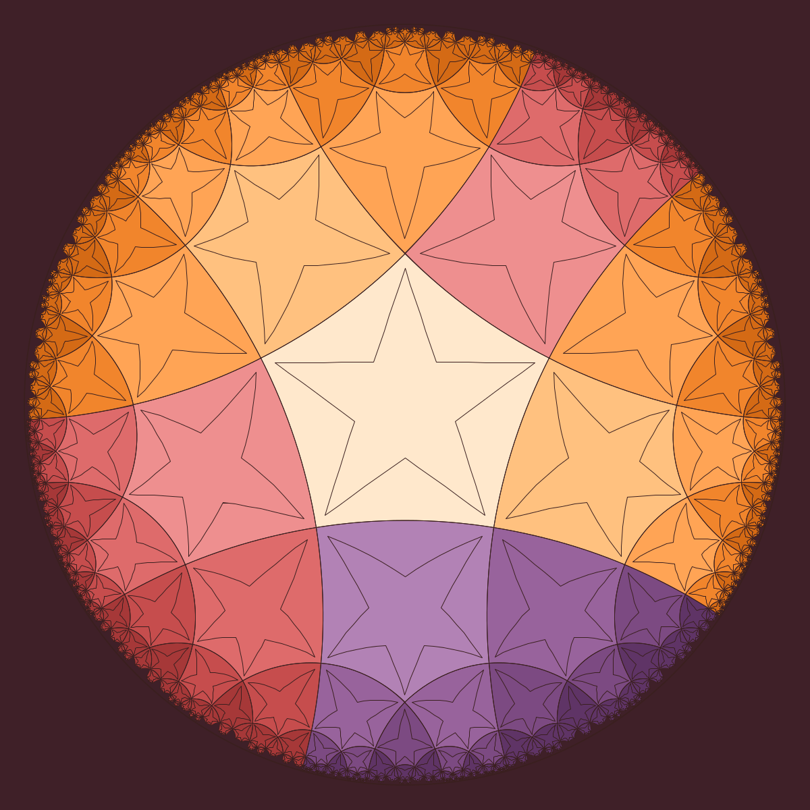
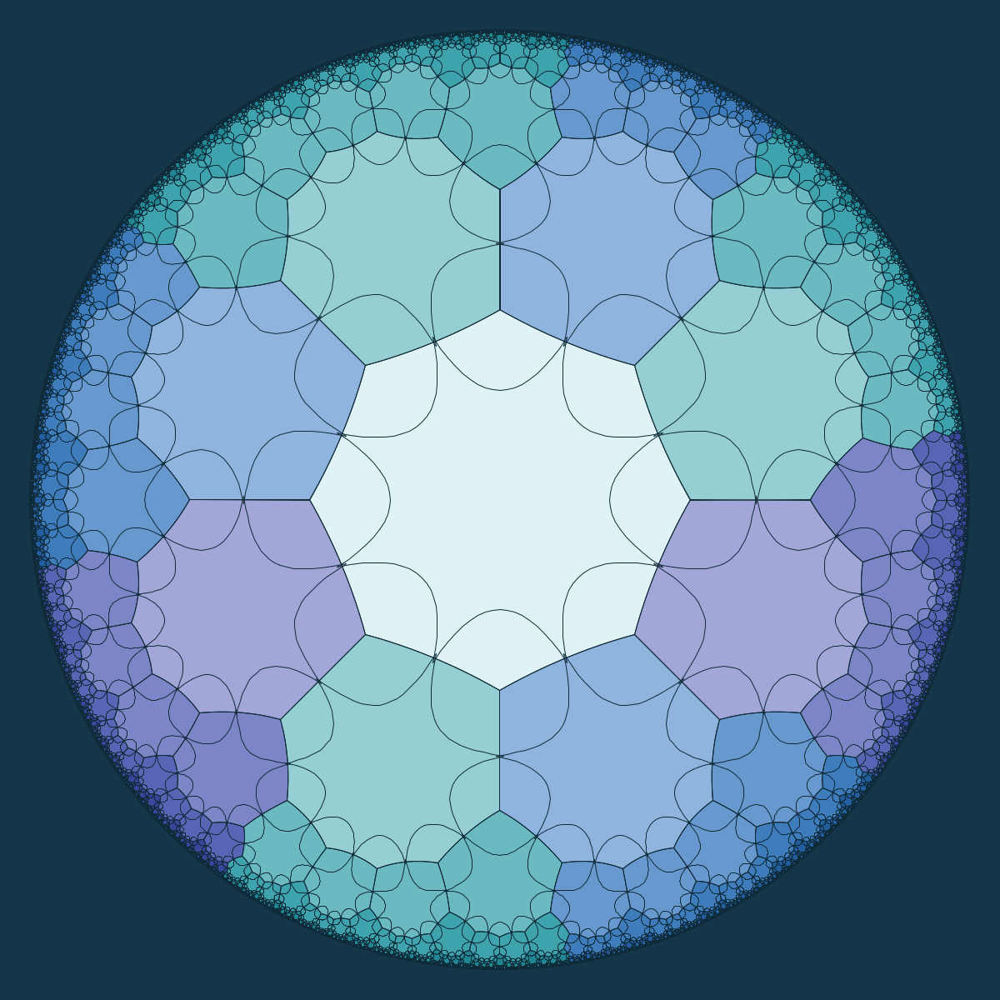
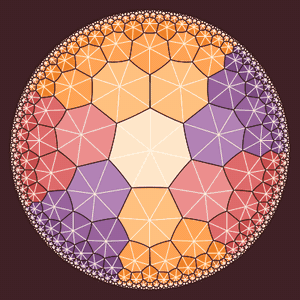

# harmony

Harmony renders regular `{p,q}` hyperbolic tessellations in the Poincaré disk model. It is a small Racket program that writes SVG or PNG.

<p align="center">
  
  
</p>
<p align="center">
  
  
</p>

## What is a `{p,q}` tiling?

A regular tessellation `{p,q}` fills the plane with regular `p`-gons meeting `q` around each vertex. Three cases exist:

| condition            | geometry    | examples                  |
|----------------------|-------------|---------------------------|
| `(p-2)(q-2) < 4`     | spherical   | `{3,3}`, `{3,4}`, `{3,5}` |
| `(p-2)(q-2) = 4`     | Euclidean   | `{3,6}`, `{4,4}`, `{6,3}` |
| `(p-2)(q-2) > 4`     | hyperbolic  | `{7,3}`, `{5,4}`, `{4,5}` |

Harmony renders the hyperbolic case, projecting the tiling onto the Poincaré disk. Sides of tiles are geodesic arcs (arcs of circles orthogonal to the boundary), and tiles shrink toward the boundary as an artifact of the projection — hyperbolically they are all congruent.

## Requirements

- [Racket](https://racket-lang.org/) 8+ (tested on 9.1).

## Usage

```
racket harmony.rkt [options]
```

Common options:

| flag                         | default        | notes                                             |
|------------------------------|----------------|---------------------------------------------------|
| `-p P`                       | `9`            | Polygon sides                                     |
| `-q Q`                       | `3`            | Polygons meeting at each vertex                   |
| `--depth D`                  | `4`            | Recursion depth of the reflection tessellation    |
| `-d W H`, `--dimensions W H` | `800 800`      | Image dimensions in pixels                        |
| `-f FILE`, `--file FILE`     | `output.svg`   | Output path. `.png` extension writes PNG          |
| `--palette NAME`             | `harmony`      | One of: `harmony`, `sunset`, `ocean`, `forest`, `mono` |
| `--motif NAME`               | (none)         | One of: `nested`, `star`, `curves` — see below   |
| `--no-spokes`                | (spokes on)    | Omit the white vertex spokes                      |
| `--animate MOTION`           | (single frame) | `rotate`, `translate`, or `both` — see Animation |
| `--frames N`                 | `60`           | Frames per loop (animation only)                  |
| `--out-dir PATH`             | `frames`       | Directory for animation frames                    |

Invalid `{p,q}` (spherical or Euclidean) is rejected with a message.

### Examples

Reproduce the hero gallery images above:

```sh
racket harmony.rkt -p 7 -q 3 --depth 9 --palette harmony -d 1200 1200 -f tiling-7-3.png
racket harmony.rkt -p 8 -q 3 --depth 7 --palette ocean   -d 1200 1200 -f tiling-8-3.png
racket harmony.rkt -p 5 -q 4 --depth 8 --palette sunset  -d 1200 1200 -f tiling-5-4.png
racket harmony.rkt -p 4 -q 5 --depth 8 --palette forest  -d 1200 1200 -f tiling-4-5.png
```

Line-art variant (no white spokes) as SVG:

```sh
racket harmony.rkt -p 6 -q 4 --depth 5 --palette mono --no-spokes -f tiling-6-4.svg
```

Tile counts scale roughly as `(p-1)(q-1)` per level. Depth 5–6 renders in well under a second; higher depths grow to a few seconds.

## Motifs

`--motif NAME` replaces the plain solid-tile look with a small geometric figure drawn inside every tile. The motif is defined in the coordinate system of the fundamental polygon, and harmony warps it through the same reflection sequence that generated each tile — so the motif "lives" inside the hyperbolic geometry, not on top of it.

<p align="center">
  
  
  
</p>

| motif    | description                                                                     |
|----------|---------------------------------------------------------------------------------|
| `nested` | A smaller similar `p`-gon inscribed in each tile.                               |
| `star`   | A `2p`-pointed star with outer points at the tile's vertices.                   |
| `curves` | A rosette of `p` quadratic-Bezier arcs between adjacent side midpoints. Because arc endpoints sit on side midpoints (shared between adjacent tiles), reflected copies join up naturally to form a continuous filigree across the whole tessellation. |

Reproduce the motif gallery:

```sh
racket harmony.rkt -p 7 -q 3 --depth 5 --palette harmony --motif nested -d 1200 1200 -f nested.png
racket harmony.rkt -p 5 -q 4 --depth 5 --palette sunset  --motif star   -d 1200 1200 -f star.png
racket harmony.rkt -p 8 -q 3 --depth 5 --palette ocean   --motif curves -d 1200 1200 -f curves.png
```

Spokes are automatically suppressed when a motif is active.

## Animation

`--animate MOTION` emits a sequence of PNG frames showing the tessellation transformed by a smooth hyperbolic isometry. The motion loops seamlessly — frame N equals frame 0 — so the output feeds directly into `ffmpeg` for GIF or MP4.

<p align="center">
  
</p>

Three motions:

| motion      | what it does                                                                    |
|-------------|---------------------------------------------------------------------------------|
| `rotate`    | Rotates the tessellation around the origin. Fits `--rotate-turns` full turns.   |
| `translate` | Hyperbolic translation with a sinusoidal envelope: tiles slide out, come back, slide the other way, come back. `--translate-dist` sets amplitude, `--translate-dir` the axis in degrees. |
| `both`      | Composition of rotation and translation.                                        |

Reproduce the demo above:

```sh
racket harmony.rkt -p 7 -q 3 --depth 7 --palette sunset -d 400 400 \
  --animate translate --frames 40 --translate-dist 1.2 --out-dir frames/

ffmpeg -framerate 20 -i frames/frame_%04d.png \
  -vf "fps=15,scale=300:300,split[s0][s1];[s0]palettegen=max_colors=64[p];[s1][p]paletteuse" \
  -loop 0 translate-7-3-sunset.gif
```

For MP4 output instead:

```sh
ffmpeg -framerate 20 -i frames/frame_%04d.png -c:v libx264 -pix_fmt yuv420p out.mp4
```

Animation notes:
- Increase `--depth` beyond your usual static value. When tiles slide across the disk, previously off-screen tiles rotate into view and would otherwise "pop in" as gaps. Depth 6–8 works well for `{7,3}`.
- Each frame takes about the same time as a single-frame render. 60 frames at depth 7 is ~15 s on a modern laptop.

## How it works

- `hyperbolic.rkt` — geometry: computes the fundamental polygon's Euclidean circumradius `sqrt(cos(π/p+π/q)/cos(π/p−π/q))`, the geodesic circle through two disk points (via inversion in the unit circle), and reflections across geodesics. Tessellation is a BFS: from the central tile, each side reflects the tile to a neighbor; duplicates are pruned by rounded centroid. Each tile carries the ordered list of reflection axes that produced it, so a motif point can be replayed through the same sequence.
- `harmony.rkt` — CLI and rendering. Tiles are rendered in three passes:
  1. filled polygons (deepest first, so shallow tiles paint on top),
  2. white "spokes" from each tile's centroid to its vertices, *or* a warped motif (mutually exclusive),
  3. outlines (thinner with depth).
  SVG uses `<path>` elliptical arcs; PNG uses `racket/draw` with a cubic-Bézier approximation of each geodesic arc.

## License

MIT — see [LICENSE](LICENSE).
